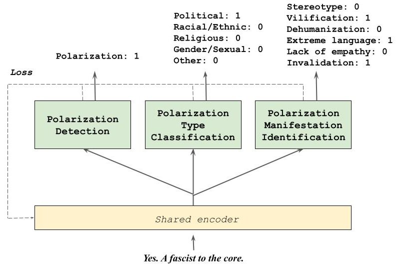

#  Multi-task Learning for Multilingual and Cross-cultural Polarization Classification

This repository contains the code associated to the paper **DigiS-FBK at SemEval-2026 Task 9: Multi-task Learning for Multilingual
and Cross-cultural Polarization Classification**, related to the SemEval 2026 task 9.


## Task overview

Online polarization promotes social fragmentation, misinformation, hate, and toxic language.
We present here the systems submitted by the DigiS-FBK team to SemEval-2026 Task 9 *POLAR* aimed at detecting polarization in textual content (subtask 1) and identifying its type (subtask 2) and manifestation (subtask 3) in a multilingual, multicultural, and multievent context. Considering the strong link between subtasks, we propose an approach that leverages a multi-task learning paradigm. 
Our results reveal that, despite the variability in scores across languages, the overall performance when using multi-task learning is higher than when adopting a single task approach in all subtasks

### Data and task decription

The *POLAR* shared task is organized into three related subtasks (S1, S2, and S3) aimed at polarization detection and characterization.

- **S1 - Polarization detection** A binary classification task aimed at identifying whether a text contains polarized content or not

- **S2 - Polarization type classification** A multi-label classification task aimed at identifying the type or target of polarized content, if any. Possible polarization types or targets are: *Political*, *Racial/Ethnic*, *Religious*, *Gender/Sexual*, *Other*

- **S3 - Polarization manifestation identification** A multi-label classification task aimed at identifying how polarization is expressed, namely which rhetorical tactics are used among the following: *Stereotype*, *Vilification*, *Dehumanization*, *Extreme language*, *Lack of empathy*, and *Invalidation*

### Languages

**Languages in subtask 1 and 2**: Amharic (amh), Arabic (arb), Bengali (ben), Burmese (mya), Chinese (zho), 
English (eng), German (deu), Hausa (hau), Hindi (hin), Italian (ita), Khmer (khm), Nepali (nep), Odia (ori), 
Persian (fas), Polish (pol), Punjabi (pan), Russian (rus), Spanish (spa), Swahili (swa), Telugu (tel), 
Turkish (tur), and Urdu (urd).
**Languages that are not included in subtask 3**: Burmese (mya), Italian (ita), Polish (pol), and Russian (rus).

## System overview

Our approach relies on multi-task learning, motivated by the observation that the three POLAR subtasks are strongly related. 
Multitask learning is a paradigm that enables a model to learn shared representations across tasks, so that information from 
one task can support the learning of the other ones.

The final configurations of our system are [S1, S2, S3] for subtasks 1 and 2, where the model sees all three subtasks, while [S1, S3] for subtask 3. We use the multilingual model XLM-RoBERTa for all languages with the exception of English, Italian, Spanish, and Polish, for which we use language-specific models.

<p align="center">
    
    <b>Fig. 1</b>: <i> High-level overview of our multi-task learning framework for polarization detection and classification, with an example from the \texttt{train} set and associated output labels for the three \textsc{polar} subtasks.</i>
</p>

## Getting started

We built our models on top of [MaChAmp](https://github.com/machamp-nlp/machamp) v0.2, a multi-task learning toolkit for NLP which allows easy fine-tuning of contextualized embeddings and multi-dataset training. To get started, clone this repository on your own path.

### Environment

Dependencies are listed in [`requirements.txt`](requirements.txt) You can run the following commands to create the virtual environment using conda:

```
conda create --name polar_venv          # create the environment
conda activate polar_venv               # activate the environment
pip install --user -r requirements.txt  # install the required packages
```

### Data

#### Get access to the datasets
To get the data, make a request to the data owners. Put, according to the subtask, the train data into the folder `dev_phase/subtaskN/train/`, the dev data into the folder `dev_phase/subtaskN/dev/`, and the test data into the folder `dev_phase/subtaskN/test`.

#### Create inputs for MachAmp
To have the data in the right format to be passed to MachAmp, run the python script `data_preprocessing.py`. The necessary files will be saved in different subfolders in `dev_phase`


## Training

### Multilingual (for all languages except English, Italian, Spanish, and Polish)

#### Subtask 1 and 2
```
python3 train.py --dataset_config configs/multilingual_1_2_3_parallel_s1_s2_s3_v2.json \
                --parameters_config configs/params_multi.json \
                --device 0
```

#### Subtask 3
```
python3 train.py --dataset_config configs/multilingual_1_3_parallel_weighted_v2_2.json \
                --parameters_config configs/params_multi.json \
                --device 0
```

### English
```
#### Subtask 1 and 2
python3 train.py --dataset_config configs/eng_1_2_3_parallel_s1_s2_s3_v2.json \
                --parameters_config configs/params_eng.json \
                --device 0
```

#### Subtask 3
```
python3 train.py --dataset_config configs/eng_1_3_parallel_weighted_v2_2.json \
                --parameters_config configs/params_eng.json \
                --device 0
```

### Spanish

#### Subtask 1 and 2
```
python3 train.py --dataset_config configs/spa_1_2_3_parallel_s1_s2_s3_v2.json \
                --parameters_config configs/params_spa.json \
                --device 0
```

#### Subtask 3
```
python3 train.py --dataset_config configs/spa_1_3_parallel_weighted_v2_2.json \
                --parameters_config configs/params_spa.json \
                --device 0
```


### Italian

#### Subtask 1 and 2
```
python3 train.py --dataset_config configs/ita_1_2_parallel_weighted_v2.json \
                --parameters_config configs/params_ita.json \
                --device 0
```

### Polish

#### Subtask 1 and 2
```
python3 train.py --dataset_config configs/pol_1_2_parallel_weighted_v2.json \
                --parameters_config configs/params_pol.json \
                --device 0
```


## Prediction

To predict the labels on the test sets, you can run the following commands corresponding to the language you are interested in.

### Multilingual (for all languages except English, Italian, Spanish, and Polish)

#### Subtask 1 and 2
```
python predict.py logs/multilingual_1_2_3_parallel_s1_s2_s3_v2/$DATETIME/model.pt \
                  "dev_phase/merged subtasks/merged_test_$LANG_data.tsv" \
                  test_prediction/multilingual_1_2_3_parallel_s1_s2_s3_v2.tsv \
                  --device 0
```

#### Subtask 3
```
python3 train.py --dataset_config configs/multilingual_1_3_parallel_weighted_v2_2.json \
                --parameters_config configs/params_multi.json \
                --device 0
```

### English
```
#### Subtask 1 and 2
python3 train.py --dataset_config configs/eng_1_2_3_parallel_s1_s2_s3_v2.json \
                --parameters_config configs/params_eng.json \
                --device 0
```

#### Subtask 3
```
python3 train.py --dataset_config configs/eng_1_3_parallel_weighted_v2_2.json \
                --parameters_config configs/params_eng.json \
                --device 0
```

### Spanish

#### Subtask 1 and 2
```
python3 train.py --dataset_config configs/spa_1_2_3_parallel_s1_s2_s3_v2.json \
                --parameters_config configs/params_spa.json \
                --device 0
```

#### Subtask 3
```
python3 train.py --dataset_config configs/spa_1_3_parallel_weighted_v2_2.json \
                --parameters_config configs/params_spa.json \
                --device 0
```


### Italian

#### Subtask 1 and 2
```
python3 train.py --dataset_config configs/ita_1_2_parallel_weighted_v2.json \
                --parameters_config configs/params_ita.json \
                --device 0
```

### Polish

#### Subtask 1 and 2
```
python3 train.py --dataset_config configs/pol_1_2_parallel_weighted_v2.json \
                --parameters_config configs/params_pol.json \
                --device 0
```
